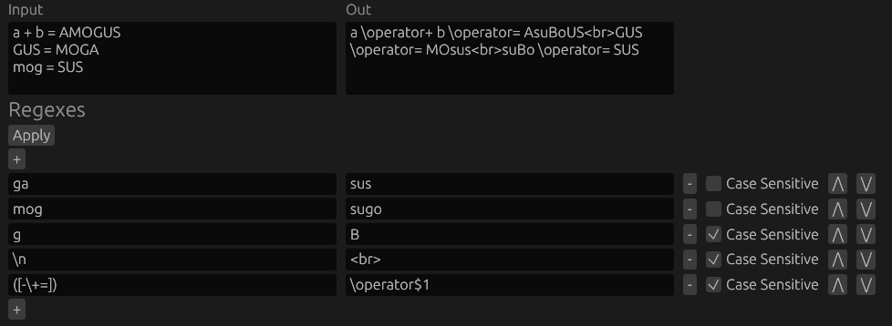
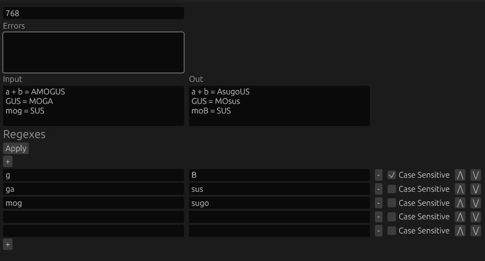
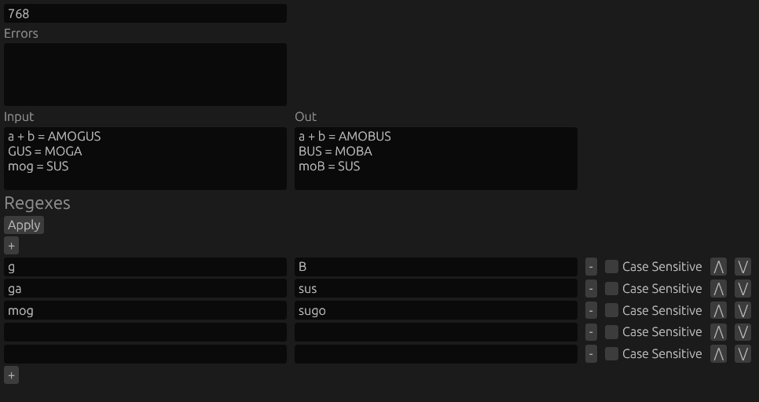
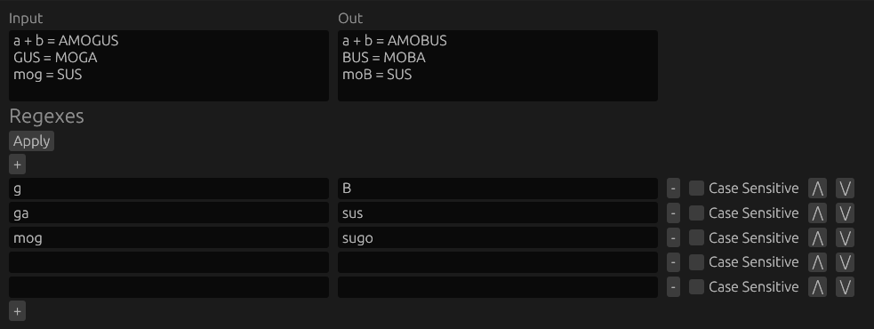

# Regexer

Regexer is my rust experiment and training, solving a problem with replacing sequential regexes on the same message.

An easy tool for processing (replacement) text with sequence of regexes.

TODO: Extension for zed and VS Code for global replacements.

I really appreciate anyone to test it and make an issue to find any other cases like `\n` and `\t`, that isn't working

